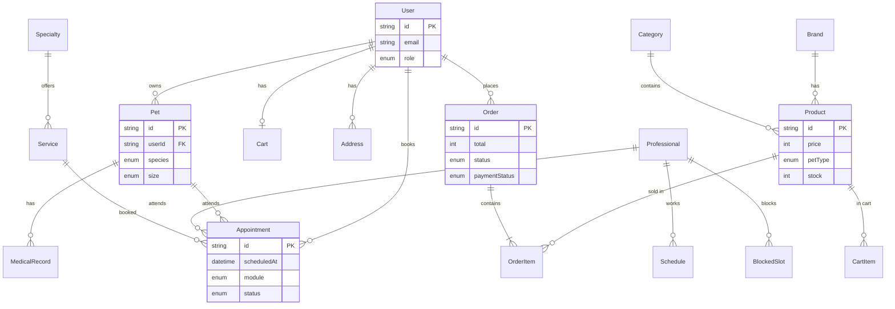

# Arquitectura — Mailo y sus Amigos

## Stack

| Capa | Tecnología |
|------|------------|
| Framework | Next.js 16 (App Router, Server Components) |
| Base de datos | **PostgreSQL (Neon)** + **Prisma** |
| Pagos | **Mercado Pago** y/o **Stripe** |
| Estilos | Tailwind CSS v4 + `tailwind.config.js` |
| Animaciones | Framer Motion |
| Despliegue | Vercel |

Referencia completa: [STACK.md](./STACK.md)

---

## Estructura de carpetas

```
src/
├── app/                          # App Router (rutas)
│   ├── (marketing)/              # Landing y páginas públicas
│   │   ├── layout.tsx
│   │   └── page.tsx              # /
│   ├── (shop)/                   # E-Commerce (SEO-friendly)
│   │   ├── layout.tsx
│   │   └── tienda/
│   │       ├── page.tsx          # /tienda — catálogo
│   │       ├── [slug]/page.tsx   # /tienda/:slug — detalle
│   │       ├── carrito/page.tsx  # /tienda/carrito
│   │       └── checkout/page.tsx # /tienda/checkout
│   ├── (booking)/                # Agendamiento (separado del shop)
│   │   ├── layout.tsx
│   │   ├── veterinaria/
│   │   │   ├── page.tsx          # /veterinaria
│   │   │   └── confirmar/page.tsx
│   │   └── peluqueria/
│   │       ├── page.tsx          # /peluqueria
│   │       └── confirmar/page.tsx
│   ├── (account)/                # Panel Pet Parent
│   │   ├── layout.tsx
│   │   └── cuenta/
│   │       ├── perfil/page.tsx
│   │       ├── mascotas/page.tsx
│   │       ├── pedidos/page.tsx
│   │       └── citas/page.tsx
│   ├── api/                      # Route Handlers
│   │   ├── products/
│   │   ├── appointments/
│   │   ├── cart/
│   │   └── webhooks/
│   │       ├── stripe/
│   │       └── mercado-pago/
│   ├── layout.tsx                # Root layout
│   └── globals.css
│
├── components/                   # Ver docs/COMPONENT_ARCHITECTURE.md
│   ├── ui/                       # Primitivos reutilizables (Button, Card…)
│   ├── shared/                   # Layout transversal (SiteShell, Header…)
│   ├── shop/                     # Dominio tienda (UI; catálogo vía Prisma en fases futuras)
│   ├── booking/
│   │   ├── shared/               # Compartido vet + peluquería
│   │   ├── veterinary/           # Solo veterinaria
│   │   └── grooming/             # Solo peluquería
│   ├── account/                  # Panel Pet Parent
│   └── marketing/                # Landing
│
├── lib/
│   ├── db/                       # Prisma client singleton
│   ├── auth/                     # Sesión y permisos
│   ├── payments/                 # Mercado Pago + Stripe
│   ├── booking/                  # Lógica de slots disponibles
│   └── utils.ts
│
├── actions/                      # Server Actions (mutaciones)
├── hooks/                        # Custom React hooks
├── types/                        # Tipos TypeScript compartidos
└── config/
    └── site.ts                   # Configuración global del sitio

prisma/
└── schema.prisma                 # Modelo de datos Neon
```

### Principios de separación

- **`(shop)`** — Catálogo optimizado para SEO (Server Components, metadata dinámica, ISR).
- **`(booking)`** — Flujos interactivos de reserva (Client Components + Server Actions).
- **`(account)`** — Área autenticada del Pet Parent.
- **`api/`** — Webhooks de pagos (Stripe, Mercado Pago) y endpoints REST.

---

## Modelo de datos (ER)



### Tablas principales

| Tabla | Propósito |
|-------|-----------|
| `users` | Pet Parents, staff y admins |
| `pets` | Mascotas registradas por usuario |
| `medical_records` | Historial clínico / vacunas |
| `products`, `brands`, `categories` | Catálogo e-commerce |
| `carts`, `cart_items` | Carrito persistente |
| `orders`, `order_items` | Pedidos y líneas de compra |
| `services`, `specialties` | Servicios vet. y peluquería |
| `professionals`, `schedules` | Staff y horarios recurrentes |
| `blocked_slots` | Bloqueos puntuales |
| `appointments` | Citas reservadas (unique por profesional + hora) |

### Lógica de slots disponibles

1. Obtener `schedules` del profesional para el día de la semana.
2. Generar slots cada `slotMinutes` entre `startTime` y `endTime`.
3. Restar `appointments` confirmadas en ese rango.
4. Restar `blocked_slots` que intersecten.
5. Filtrar slots pasados (timezone `America/Santiago`).

---

## Flujos clave

### Agendamiento (Veterinaria / Peluquería)

```
Usuario → Selecciona mascota → Servicio/especialidad → Profesional
       → Calendario (slots libres) → Confirmación → Appointment PENDING/CONFIRMED
```

### E-Commerce

```
Catálogo (SSR) → Filtros → Detalle → Carrito → Checkout → Mercado Pago / Stripe → Webhook → Order PAID
```

---

## Variables de entorno

Ver `.env.example` para `DATABASE_URL`, auth, Mercado Pago, Stripe y URLs públicas.
